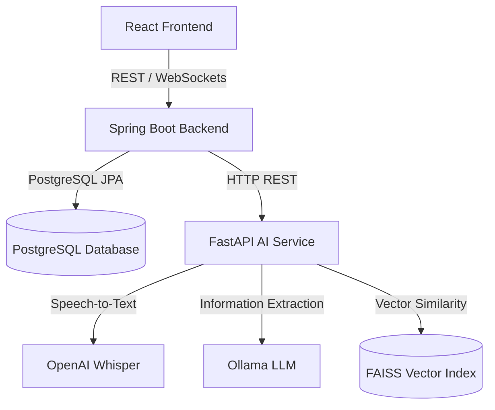

# 📁 AI Collaboration Platform

This is a production-ready, SaaS-style AI collaboration workspace that transforms voice notes into structured database entries, extracts Jira-style tasks with automated suggestions, coordinates Slack-style live chat rooms, and supports a ChatGPT-style RAG meeting chatbot using purely **free and local AI tools**.

---

## 🌟 SaaS Platform Features

*   **React + TypeScript Frontend**: Stunning, responsive dashboard built with Tailwind CSS, Framer Motion, and Lucide icons supporting both Light & Dark modes.
*   **Spring Boot + PostgreSQL Backend**: Secure, multi-tier microservice handling JWT Authentication, WebSocket STOMP messaging, and PostgreSQL persistence.
*   **FastAPI AI Service**: Extended Python pipeline running Whisper Speech-To-Text, LangChain Ollama data extraction, and HuggingFace SentenceTransformers embeddings.
*   **FAISS Vector Indexing & RAG**: Creates a dedicated FAISS vector index per meeting. Users can chat with their meeting recordings using Ollama with full reference tracing (zero OpenAI/Gemini/Claude cost).
*   **Jira-style Task Board**: Organizes team tasks into columns (`To Do`, `In Progress`, `Completed`). AI analyzes meetings and recommends task updates (Accept/Reject transitions).
*   **Slack-style Communication**: Real-time STOMP-based chat rooms with joining/leaving actions, message history, online member rosters, and typing indicators.

---

## 🛠 Tech Stack

*   **Frontend**: React (v19), TypeScript, Tailwind CSS, Framer Motion
*   **Backend**: Spring Boot 3.5, Spring Security, JWT, WebSockets (STOMP), Hibernate/JPA
*   **AI Engine**: FastAPI, OpenAI Whisper, LangChain, Ollama (`llama3.2:3b`), FAISS, `sentence-transformers`
*   **Database**: PostgreSQL 15

---

## 🚀 Architecture



---

## 🟢 Local Setup Instructions (Docker Compose)

The entire platform is containerized and orchestrates databases, services, and local AI engines out of the box.

### Prerequisites
*   Docker & Docker Compose installed.

### Setup Steps

1.  **Clone the workspace** and navigate to the directory:
    ```bash
    git clone https://github.com/your-username/ai-meeting.git
    cd ai-meeting
    ```

2.  **Launch the container cluster**:
    ```bash
    docker-compose up --build -d
    ```

3.  **Download the LLM Model inside Ollama**:
    Once the container is running, download the `llama3.2:3b` model to your local Ollama volume:
    ```bash
    docker exec -it aimeeting-ollama ollama pull llama3.2:3b
    ```

4.  **Access the Platform**:
    *   **React SaaS Dashboard**: [http://localhost](http://localhost)
    *   **Spring Boot Backend REST API**: [http://localhost:8080](http://localhost:8080)
    *   **FastAPI AI Service Documentation**: [http://localhost:8000/docs](http://localhost:8000/docs)

---

## 📁 Database Schema (PostgreSQL)

The platform creates the following relational database tables on boot:

*   `users`: ID, Name, Email, Password (hashed), Avatar link.
*   `meetings`: ID, Title, Description, Date, Start/End times, Summary text, full Transcript, Host user ID.
*   `transcript_chunks`: ID, Meeting ID, Chunk text, Chunk index, Start/End timestamp.
*   `tasks`: ID, Title, Description, Status (`TODO`, `IN_PROGRESS`, `COMPLETED`), Assigned user ID, Meeting ID, AI suggested update transition string.
*   `notifications`: ID, User ID, Notification message text, read status, creation time.
*   `rooms`: ID, Channel Name, Description, Created timestamp.
*   `messages`: ID, Room ID, Sender ID, Message text, Timestamp.
*   `user_rooms`: Join table linking users and rooms.

---

## 💡 How the AI Features Work

### 1. Upload & Processing
When you drop an `.mp3` or voice note onto the dashboard:
1.  Spring Boot uploads the file to FastAPI `/process/`.
2.  FastAPI runs **Whisper** to transcribe the voice data.
3.  FastAPI splits the transcript into overlapping text chunks (for FAISS indexing).
4.  FastAPI calls **Ollama** using LangChain to extract metadata (times, client name) and generate a Markdown meeting summary.
5.  FastAPI queries Ollama to extract actionable Jira-style tasks.
6.  Spring Boot saves all this structured data (meeting, chunks, tasks) in **PostgreSQL**.
7.  Spring Boot calls FastAPI `/index/` to compute embeddings for the chunks and persist a dedicated **FAISS vector store** index file.

### 2. RAG Chatbot
When you ask a question about a meeting in the chatbot workspace tab:
1.  Spring Boot sends the question to FastAPI `/rag/`.
2.  FastAPI loads the local FAISS index for that specific meeting ID.
3.  Performs similarity search to grab the top-4 relevant transcript chunks.
4.  Injects the chunks as context into the **Ollama** prompt template.
5.  Ollama generates a response, referencing exactly which chunks were utilized to eliminate hallucinations.
